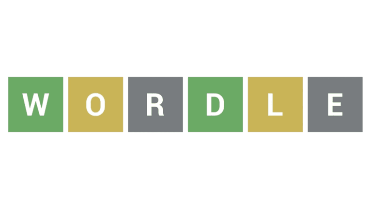

# Wordle Discord Bot

Wordle, the popular web-based word puzzle game, captivates players worldwide by challenging them to guess a five-letter word within six attempts. This game is renowned for its engaging gameplay and the instant feedback provided through a system of color-coded tiles, indicating the accuracy of the players' guesses. Expanding on this beloved concept, our project introduces an innovative iteration: a Discord bot version of Wordle. This new format allows players to enjoy the game within Discord servers, enhancing accessibility and integrating the puzzle into a social platform to attract a wider audience.




## How to Run 

To install and run the Wordle Discord Bot for your personal server, follow these steps:

- Copy/paste the link below into your web browser:
    ```
    https://discord.com/oauth2/authorize?client_id=1225441143383396372&permissions=9141837900800&scope=bot+applications.commands
    ```
You should see a menu on Discord with the icon of the bot next to yours. Choose the server you want to add the bot to and click "Authorize". 
(note: You need to have the "Manage Server" permission to be able to successfully select a server)

- You're all finished (the bot is up and running)! Enjoy using the Wordle bot, type /help for more info on commands.

## How to Contribute

To contribute to the development of the Wordle Discord Bot, follow the instructions on our project board available [here](https://temple-team-fykau2e3.atlassian.net/jira/software/projects/SCRUM/boards/1/backlog).
See the **"How to Build"** section for how to install a local copy of the bot.

## How to Build

To build the Wordle Discord Bot from source, follow these steps:


- Download the latest version of [Node.js](https://nodejs.org/en). Node.js includes the package manager npm, which we'll use later to help with installing our needed dependencies (things our program needs to run).
- Click the green box labeled 'Code', then copy the link under 'HTTPS' by clicking the clipboard icon. 
- Open your preferred Javascript IDE of choice ([VSCode](https://code.visualstudio.com/) is our recommendation). Type in terminal:
    ```
    git clone {your url}
    ```
    to clone the current release to your local repository.

- To install all needed dependencies, run:
    
    ```
    npm install
    ```
- To initialize and configure a local copy of the database, run:

    ```
    node admin.js
    ```

- To test the bot, invite it to a personal Discord server of your choosing. Follow the instructions in **"How to Run"** for more information.
- After inviting the bot, start it via the command:

    ```
    node index.js
    ```
- To stop the bot, interrupt the running process by typing Ctrl+C in your terminal.  
- Commands for the bot are found in the commands/utility folder. To edit a command, first stop your bot (see above for command). After adding/editing a command, update your bot by running:

    ```
    node deploy-commands.js
    ```
